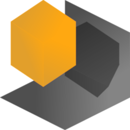

# FragRoom

Application to run GLSL fragment shaders

## What is FragRoom?
It is a small application that allows you to execute GLSL fragment shaders. These shaders are small programs that run once for every pixel. With them you can make stunning visuals and art.

## How is it used?
You open the files containing the raw GLSL code. They can also have additional options(Discussed later)
You can directly open the files (**.fgrom** or **.glsl**) with the app, or directly execute the program and it will try to execute one of the following: *fragment.fgrom*, *shader.fgrom*, *fragment.glsl*, *shader.glsl*.
If the application can't find the specified file or any of the following, it will display a warning and a green/blue interrogation mark.
If the compiling process of the shader fails, it will display a warning detailing the error(so you have a hint on what to solve ;) ), and it will display a yellow/red warning symbol.

## Code-wise specifications
The input of the shader is a vec2 called **fragCoord**. It has the coordinates of the pixel, ranging from \[-1, -1\](Left bottom corner) to \[1, 1\](Right top corner).
The output is a vec4 called **fragColor** (R, G, B, Alpha).
There are also two uniforms, both floats: **iTime**, wich is the time since the application started, in seconds; and **iResolution**, wich is the size of the display, in pixels.
There are examples of its use in [here](./examples).

This application provides with aditional options, also contained in the code file. They are passed in the form *@option : value*.
The application will read these lines at the start if the file only, and will stop when encountering a blank line.
These are all the options:
|Option|Values|Description|
|---:|:---|---|
|title|any string|The title of the window. It can include special sequences, discussed later|
|width|non-negative number|The starting width of the window|
|height|non-negative number|The starting height of the window|
|allowClose|0 or 1|If it allows the window to be closed with a key. Default will allow|
|closeKey|number representing a key|The key that will close the app. Can also type *esc* and it will be the escape key. Default is the escape key|
|secsToAutoClose|non-negative number|How many seconds the app will wait before closing. Default is it won't close|
|fullscreen|0 or 1|If the application starts fullscreened. Default is not|
|allowToggleFullscreen|0 or 1|If you will be able to toggle fullscreen on and off. Default is allowed|
|fullscreenKey|number representing a key|The key that will toggle fullscreen. Can also type *f11* and it will be F11 key. Default is F11 key|
|grabCursor|0 or 1|If the cursor will be grabbed by the application or not. Default is not|
|maxFps|non-negative number|The maximum fps. Default is 144|
|icon|file path|The path to the **.ico** file that will be used as icon. Default is the normal app icon|
You can find examples [here](./examples/options).

These are the special sequences for the title:
|Option|Value|
|---:|:---|
|%p|The full path of the shader file|
|%f|Name of the shader file, with extension|
|%n|Name of the shader file, without extension|
|%d|Current date|
You can find examples [here](./examples/title).